# State pattern

## State pattern

State pattern as described in "Design Patterns: Elements of Reusable Object-Oriented Software" book (1994).

Inactive->Connecting->Connected.

```{.csharp .number-lines}
internal class NetworkConnectionState {
	public virtual void Connect()      {/* no-op */}
	public virtual void Disconnect()   {/* no-op */}
	public virtual void Send(int data) {/* no-op */}
	public virtual int? Recv()         {return null;}

	internal NetworkConnection connection;
}

public class NetworkConnection {
	public NetworkConnection() {_state = new NetworkConnectionInactiveState(this);}

	public void Connect()      {_state.Connect();}
	public void Disconnect()   {_state.Disconnect();}
	public void Send(int data) {_state.Send(data);}
	public int? Recv()         {return _state.Recv();}

	internal void ChangeState(NetworkConnectionState newState) {
		_state = newState;
	}
	private NetworkConnectionState _state;
}
```

## State pattern

```{.csharp .number-lines}
internal class NetworkConnectionInactiveState : NetworkConnectionState {
	public NetworkConnectionInactiveState(NetworkConnection setConnection) {
		connection = setConnection;
	}

	public override void Connect() {
		connection.ChangeState(new NetworkConnectionConnectingState(connection));
	}
}

internal class NetworkConnectionConnectingState : NetworkConnectionState {
	public NetworkConnectionConnectingState(NetworkConnection setConnection) {
		connection = setConnection;
	}

	public override void Disconnect() {
		connection.ChangeState(new NetworkConnectionInactiveState(connection));
	}

	public override int? Recv() {
		if(...)
			connection.ChangeState(new NetworkConnectionConnectedState(connection));
		return null;
	}
}

internal class NetworkConnectionConnectedState : NetworkConnectionState {
	public NetworkConnectionConnectedState(NetworkConnection setConnection) {
		connection = setConnection;
	}
	public override void Disconnect() {
		connection.ChangeState(new NetworkConnectionInactiveState(connection));
	}
	public void Send(int data) {
		...
	}
	public override int? Recv() {
		return ...;
	}
}
```

## State pattern

- Rarely used.
- Might be considered bad practice.
- Is closely related to state machine.

# Automata theory

## Automata theory

- Theoretical computer science
- Well defined
- Formal
- Works
- Most of what we do in programming can be observed through lens of automata theory and reasoned with formal tools

# Deterministic finite-state machine (DFA)

## Deterministic finite-state machine

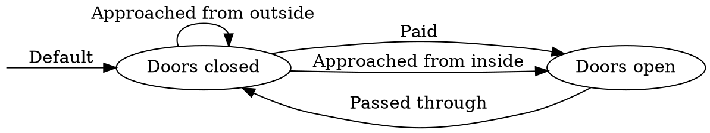

- Tunnelbana
- It's a graph
- Nodes are states
- Edges are events

## Can be represented as state transition table

Columns are events, every row is a transition from a particular state to a new state.

State ↓ Event → | "Paid" | "Passed Through" | "Approaching outside" | "Approaching inside"
:---|:---:|:---:|:---:|:---:
Door closed | Door open | ??? | Door closed | Door open
Door open | ??? | Door closed | ??? | ???

It's good to have an idea how to answer to unexpected events.

## Can be represented in code

```{.csharp .number-lines}
class Turnstile {
	public enum State {
		DoorClosed,
		DoorOpen
	}

	public enum Event {
		Paid,
		PassedThrough,
		ApproachedFromOutside,
		ApproachedFromInside
	}

	private State _state = State.DoorClosed;

	public void OnEvent(Event newEvent)
	{
		switch (newEvent)
		{
		case Event.Paid:
			switch (_state) {
				// notice we can also just call some other function here
				case State.DoorClosed: _state = State.DoorOpen; break;
			}
			break;
		case Event.PassedThrough:
			switch (_state) {
				case State.DoorOpen: _state = State.DoorClosed; break;
			}
			break;
		case Event.ApproachedFromOutside:
			switch (_state) {
				case State.DoorClosed: break;
			}
			break;
		case Event.ApproachedFromInside:
			switch (_state) {
				case State.DoorClosed: _state = State.DoorOpen; break;
			}
			break;
		}
	}
}
```

## Can be represented as Lookup Table (LUT)

```{.csharp .number-lines}
class Turnstile {
	public enum State {
		Invalid = -1,
		DoorClosed = 0,
		DoorOpen = 1
	}

	public enum Event {
		Paid = 0,
		PassedThrough = 1,
		ApproachedFromOutside = 2,
		ApproachedFromInside = 3
	}

	private State _state = State.DoorClosed;

	private State[][] _lut = new State[][]
	{
		new [] { // current is DoorClosed
			State.DoorOpen,   // Paid
			State.Invalid,    // PassedThrough
			State.DoorClosed, // ApproachedFromOutside
			State.DoorOpen,   // ApproachedFromInside
		},
		new [] { // current is DoorOpen
			State.Invalid,    // Paid
			State.DoorClosed, // PassedThrough
			State.Invalid,    // ApproachedFromOutside
			State.Invalid,    // ApproachedFromInside
		}
	};

	public void OnEvent(Event newEvent) {
		_state = _lut[(int)_state][(int)newEvent];
	}
}
```

Code is data? Data is code?

## Generating events on edges

We can also create events during transitions (graph edges).

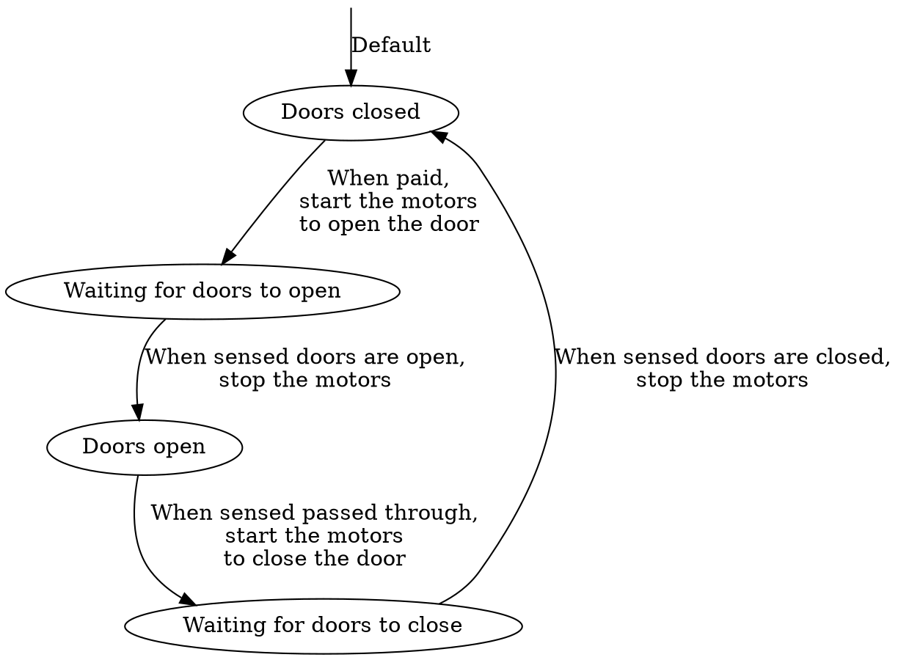

# Hierarchical finite-state machine (HFSM)

## Hierarchical finite-state machine

- Too many states, state machines tend to explode.
- Group by areas / concerns / problems.
- When higher level state machine changes states, lower level state machine can do a "reset".

## Hierarchical finite-state machine (sample from Emergent AI)

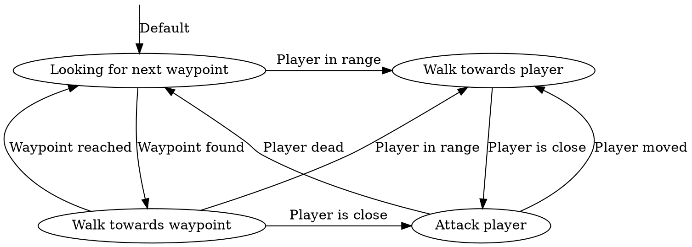

## Hierarchical finite-state machine (sample from Emergent AI)

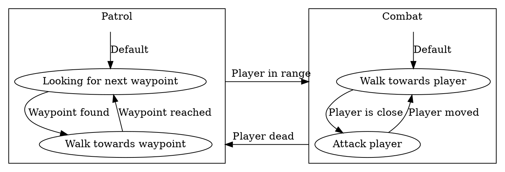

# Nondeterministic finite-state machine (NFA)

## Nondeterministic finite-state machine

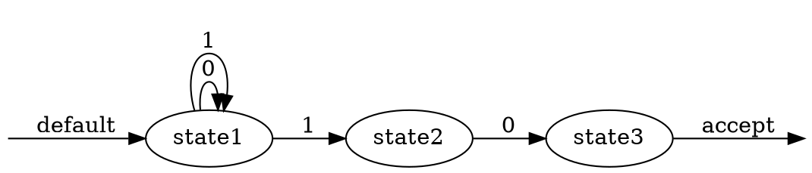

- It is a parser for strings like `10`, `010`, `11110`, `0001110000011110010`, etc.
- Can written as `[01]*10` regex, and [regexper.com](https://regexper.com/#%5B01%5D*10) gives us this:


- Oh wait, but how do we code _that_!?

## Nondeterministic finite-state machine

From [wiki](https://en.wikipedia.org/wiki/Nondeterministic_finite_automaton):

	An NFA, similar to a DFA, consumes a string of input symbols.
	For each input symbol, it transitions to a new state until all input symbols have been consumed.
	In each step, the automaton arbitrarily chooses one of the applicable transitions.
	If there exists some "lucky run", i.e. some sequence of choices leading to an accepting state after completely consuming the input, it is accepted.
	Otherwise, i.e. if no choice sequence at all can consume all the input and lead to an accepting state, the input is rejected

Any NFA can be converted to DFA via [subset construction algorithm](https://en.wikipedia.org/wiki/Powerset_construction) (invented in 1959!),
hence NFA is a super set / generalization of DFA.

DFA for `[01]*10` regex will be:

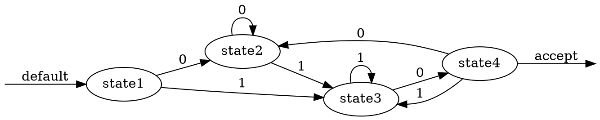

You can [try it online](https://cyberzhg.github.io/toolbox/nfa2dfa).

NFA-to-DFA is not always the most efficient way to execute the algorithm,
hence why regex implementations usually go via [Recursive Backtracking and others](https://deniskyashif.com/2019/02/17/implementing-a-regular-expression-engine/).

# Probabilistic automaton (PA)

## Probabilistic automaton

PA is generalization of NFA.

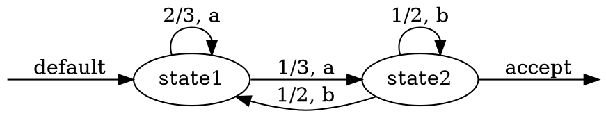

Note, sum of probabilities is 1.

## Probabilistic automaton

In gamedev useful for generating behavioral systems.

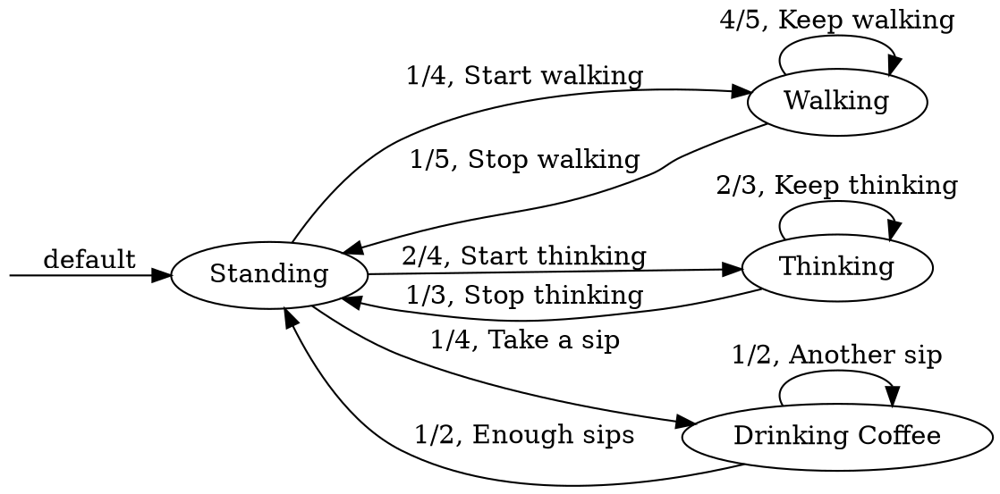

If we only read the edges, it will generate sequences like:

- Start walking, Keep walking, Stop walking, Take a sip, Enough sips, Start thinking, ...
- Take a sip, Another sip, Another sip, Another sip, ...

## Automata theory

Automata theory is so much more:

- Formal languages
- Formal grammars
- Abstract machines
- Theory of computation

# Dot files

## Graphviz

- You can draw graphs by hand, in google slides, etc.
- You can implement graphs with code, with data, etc.
- Good to have something that can draw graphs for you.

[Graphviz](https://graphviz.org/) is one such tool,
and because it's based on text files it means it outlived many other technologies (started in 1991!).

Graphviz uses DOT graph description language.
DOT can be trivially parsed, so later you can use it to generate interactive diagrams, code, etc.

Try it out with [Graphviz Online](https://dreampuf.github.io/GraphvizOnline/).

## Graphviz example: basics

```{.dot .number-lines}
digraph GraphName {
	a; b;
	a -> b;
}
```

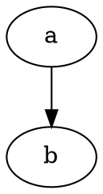

```{.dot .number-lines}
graph GraphName {
	a; b;
	a -- b;
}
```

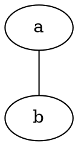

## Graphviz example: labels and more

```{.dot .number-lines}
digraph G {
	rankdir=LR;

	a [label = "State A" shape=box fillcolor=grey];
	b [label = "State B" shape=diamond];
	a -> b [ label = "Edge A to B"];
}
```

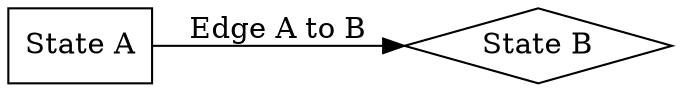

## Graphviz example: subgraph

```{.dot .number-lines}
digraph G {
	compound=true;
	newrank=true;

	subgraph cluster_groupa {
		a -> a -> b -> c;
	}

	subgraph cluster_groupb {
		d -> e -> f -> f;
	}

	a -> d [ltail=cluster_groupa lhead=cluster_groupb minlen=5];

	{rank=same; a; d;}
}
```

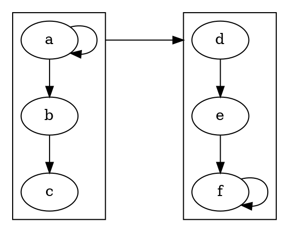

# Self study

## Self study

- What are the main properties or a state pattern?
- What is DFA and it's main properties?
- What are the common ways to implement DFA in code?
- What are the properties of HFSM and why it can be useful?
- What is NFA and it's main properties?

- [Game Programming Patterns: State](http://gameprogrammingpatterns.com/state.html)
- [Wiki: Automata theory](https://en.wikipedia.org/wiki/Automata_theory)

Bonus:

- What is Pushdown automata and it's main properties?
- What are Concurrent State Machines?
- [Wiki: Regular expression](https://en.wikipedia.org/wiki/Regular_expression)
- [Learn Regex: A Beginner’s Guide](https://www.sitepoint.com/learn-regex/) get the basics in 15 min
- [Regex visualizer](https://regexper.com/)
- [Regex debugger](https://regex101.com/)

Exercise:
```
Implement a character class with states forming a DFA. Where nodes are character states like standing, walking, jumping, crouch, attack, etc and events are keyboard inputs, animation endings, etc.

- Model the state graph on paper (optionally, try graphviz online or any other graph editor with autolayout).
- Implement DFA as nested switch-cases.
- Implement DFA as LUT.

In pairs or groups, discuss each others state machines, try to see if they are robust, would they break if some events like keyboards input come at unexpected times? (trying to jump while in crouch, etc).

Optionally:
- Try implementing a PA that drives events to the DFA, to make a NPC from the character.
```