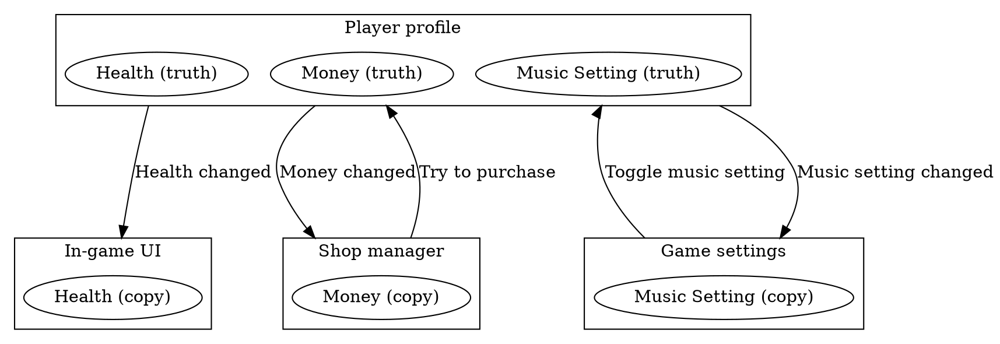

# Quick historical overview of user interfaces

## Systems user interfaces

Systems UI historically only render when something changed, and they only "repaint" parts of the screen that actually changed.

Games usually render full frame every VSync-ish (it's a bit blurry when we're talking about adaptive sync).

That is why calculator made with Cocoa Touch on iOS barely drains any battery, but a calculator made with Unity will heat-up your phone, drain battery, etc.

Systems UI historically had very little notion of "ticks"/"pumps"/"updates"/"rendering", but instead were taking a more reactive approach:

```{.csharp .number-lines}
class UICheckbox : Widget
{
	private bool state;

	public void SetState(bool newState)
	{
		state = newState;
		RepaintMe();
	}

	public void OnMouseClick()
	{
		SetState(!state);
	}

	public void Repaint()
	{
		InvalidateRect(x, y, w, h);
		// this historically was crazy slow
		DrawSprite(..., x, y, ...);
	}
}
```

## Systems user interfaces

How UI get changes and react to them is a highly flourishing part of programming. They literally tried anything and everything: events, message queues, property binding, reactive programming (as in MVC, etc), functional reactive programming, actor based, etc.

In more modern times. As HTML DOM is also stateful, this influenced modern web development industry: React/Angular/Vue/etc are in part solving transition between events and statefulness (virtual DOM diffing is one of the ways there).

UI in game development also took a different turn, dropping encapsulating widgets all-together. Classic UI is called retained mode UI, while this approach is called immediate UI. IMGUI is one such example of immediate UI:

```{.cplusplus .number-lines}
void EveryFrame()
{
	static bool check = true;
	ImGui::Checkbox("checkbox", &check);

	if(isLuckyFrame) // Pink text will only be rendered if this is true
		ImGui::TextColored(ImVec4(1.0f, 0.0f, 1.0f, 1.0f), "Pink");

	ImGui::TextColored(ImVec4(1.0f, 1.0f, 0.0f, 1.0f), "Yellow");
	ImGui::TextDisabled("Disabled");
}
```

# The biggest gotcha you'll ever get yourself into

## Coupling of data between systems

One can usually find this:

```{.csharp .number-lines}
public GameSettings {
	public bool Music;

	public GameSettings Instance { ... }
}

public GameSettingsUI {
	public UIElements.Toggle Music;
}

public SomeOtherCodeThatHasNoKnowledgeAboutUI {
	void DoSomething() {
		GameSettings.Instance.Music = !GameSettings.Instance.Music;

		// So, and how do we update UI state?
	}
}
```

## Coupling of data between contexts

```{.csharp .number-lines}
public PlayerProfile {
	public int Money;

	public PlayerProfile Instance { ... }
}

public SomeRandomGameSystem {
	void OnEnable() {
		someSubSystem.onSomeEvent += () => {
			// Oh, we're somewhere completely different, another thread? another point in the player loop?
			// PlayerProfile.Instance.Money is not accessible because it's not thread safe,
			// so we need to indirectly inject a copy of it here.
			// But how do we know the copy is up to date?
			SomeOtherFunctionThatWePrettyMuchHaveToCallHere(_playerProfileMoneyCopy);
		}
	}

	private int _playerProfileMoneyCopy = %dont_forget_to_intialize_me%;

	void OnUpdate() {
		_playerProfileMoneyCopy = PlayerProfile.singleton.money;
	}
}
```

## Coupling of state machines between systems

Less obvious example:

- The game has a state machine (in-game, paused, store, etc)
- The game shows modal UI for the user to make a decision.
- The game waits for modal UI to "finish" to proceed.

In this case, the game leaks state machine to the UI state.

Now the real state machine is game state + UI state.

What if UI "finishes" for some other reason,
for example if a game designer modified the UI in the editor and caused the UI to hot reload?

# Observer pattern

## Observer pattern

::: columns
:::: column

```{.csharp .number-lines}
public class UserProfile {
	public int Money {
		set {
			var previousValue = _money;
			_money = value;

			// notify subscribers
			foreach (var subscriber in _moneySubscribers)
				subscriber(previousValue, value);
		}
		get => _money;
	}

	public delegate void OnMoneyChangeDelegate(int previousValue, int newValue);

	public event OnMoneyChangeDelegate onMoneyChange {
		add =>    _moneySubscribers.Add(value);
		remove => _moneySubscribers.Remove(value);
	}

	private List<OnMoneyChangeDelegate> _moneySubscribers = ...;
	private int _money; // the source of truth
}
```

::::
:::: column

```{.csharp .number-lines}
public class SomeSystem {
	private UserProfile _profile;
	private int _observedMoney;

	public void Start() {
		_profile = new UserProfile();
		_profile.onMoneyChange += (previousValue, newValue) => {
			Debug.Log($"money changed from {previousValue} to {newValue}");
			_observedMoney = newValue;
		};
	}

	public void Update() {
		_profile.Money = ...;
	}
}
```

::::
:::

Some gotcha's:

- Don't forget to unregister your subscribers! Also don't forget not to register them twice! See [Lapsed listener problem](https://en.wikipedia.org/wiki/Lapsed_listener_problem).
- Notice how setting a new value from a callback will create havoc as a new update can come out of order with old update.

# Push and Pull

## Pull model / Message driven code

- When we're ready, we ask for everything that happened since last time.
  And we react to it on our own terms.
- We "pull" messages/events. Usually implies some sort of message queue / message bus.
- Usually: inputs, window movements, network packets, etc.
- Sometimes we can "peek" messages, meaning look what is on the queue without poping it.
- Formal side is covered by [Queueing theory](https://en.wikipedia.org/wiki/Queueing_theory).

Most of game development is done in pull mode. Generally we implement large pipelines.

We run in a loop, and every frame trying to process everything that happened since last frame.

Example [Input.GetAccelerationEvent](https://docs.unity3d.com/2021.2/Documentation/ScriptReference/Input.GetAccelerationEvent.html).

## Pull pros

- We can design and enforce a very robust, easy-to-understand processing order.
- Easy to be in control and orchestrate everything.
- Easy to use iterative numerical methods `f(i+1) = f(i) + ...` that rely on storing previous values and time since last operation.

## Pull cons

- Latency (like input latency) and [Bufferbloat](https://en.wikipedia.org/wiki/Bufferbloat). How many messages can you process at once and still hit your FPS targets?
- Often, only one place in the code can listen to messages, because they are usually popped from the queue and another code will not see them, this requires that specific place in the code to be aware about all the other places that might be interested in the messages, and notify them somehow. This creates a classic "everything knows about everything" problem of tight coupling between systems.

## Push model / Event driven code

- When something happens, our code gets executed directly, via means of callbacks.
- We get "push" notification.
- Usually: UI, application lifetime notifications, linux signals, asynchronous procedure calls, etc. But can be just normal callbacks get called on completion of something, like async file read.
- Callbacks then can start more work.
- Observer pattern as described here is a push model code.

Usually limited adoption in general game development. Events are mostly used for UI programming (event bubbling).

Outside of gamedev, event push model is very popular in web and backend development. Generally their processing is very shallow and fast.

Example [Application.logMessageReceivedThreaded](https://docs.unity3d.com/2021.2/Documentation/ScriptReference/Application-logMessageReceivedThreaded.html).

## Push pros

- Nearly zero latency can be achieved.
- Usually whoever posts events doesn't have to know anything about who receives events and in which order. That makes it easier to write code by moving the problem to the "user" of that code.

## Push cons

- Extremely hard to reason something about absolute order of anything.
- Systems become more transactional, e.g. events are "hot potato"
- Hard to achieve predictable timings, jitter. Historically browsers were not able to get the timing right in relation to VSync to get a stable FPS.
- Event callbacks have to be fast, otherwise they block the caller.

## Push example in UI event propagation in DOM


(From [here](http://www.thatjsdude.com/interview/dom.html))

## Challenges of mixing pull code with push code

You are never prepared for it.

Exhibit A: Out-of-band event notification: Imagine your game is in a middle of rendering something, you get a push notification "spacebar just got pressed, you need to jump", the heck you gonna do? Cancel your in-flight render and start again? Probably not. Hence usually we cannot do anything about it and have to delay the "reaction" to the next frame.

Exhibit B: Out-of-context event notification: Imagine your player was trying to buy a mega potion via in-app-purchase (real money) while in fight with a boss. While bank transaction was completing, they died and you just got a push notification that they just spent 10$ on a potion, now what?

Having push and pull mixed is eventually unavoidable in a bigger project. Good idea not to leave it without a fight though. Mixing both _will_ generate problems.


(From [here](https://subscription.packtpub.com/book/application_development/9781788629775/1/ch01lvl1sec14/pull-versus-push-based-reactive-programming))

## Impedance mismatch

Generally this class of problems is known as [Impedance mismatch](https://en.wikipedia.org/wiki/Impedance_matching): (note this is not a very common usage of the term)

- Every time you go from push to pull you need to make an impedance matching code to put your notification into a queue.
- Every time you go from pull to push, you need to call callbacks from observers list of some sorts.

It's more visible in backend where impedance matching takes a form of a literal server(s) converting pushes to pulls and back.


(From [here](https://medium.com/@_JeffPoole/thoughts-on-push-vs-pull-architectures-666f1eab20c2))

## Stale state via in-band events

So you're queuing your pushes to a queue and process it once a frame. What data you're operating in meanwhile? Stale data!

What data are you using before you got your first push? Unknown data!

```{.csharp .number-lines}
public class GameUI {
	private Label _healthLabel;
	private int _playerHealth;

	public void OnPlayerHealthChange(int newHealth) {
		_playerHealth = newHealth;
	}

	public void Update() {
		// 1) What if OnPlayerHealthChange is not called first few seconds?
		// 2) What if OnPlayerHealthChange is called after our OnUpdate is called?
		_healthLabel.text = $"Player Health: {_playerHealth}"
	}
}
```

## Stale state via out-of-band events

```{.csharp .number-lines}
public class MagicNerf {

	// Observer number 1
	public void OnPlayerHealthChange(int newHealth) {

		// Can't have illegal amount of health.
		if(newHealth == 420)
			DoPlayerDamage(1);

	}
}

public class GameUI {

	private int _playerHealth;

	// Observer number 2
	public void OnPlayerHealthChange(int newHealth) {
		_playerHealth = newHealth;

		// We will receive 419 and only then receive 420
	}
}
```

Usually you would need to delay the changes somehow, and have a point in your application lifetime where you apply them.

Remark: practical debugging session.

## Delaying changes

```{.csharp .number-lines}
public class MagicNerf {

	internal struct HealthOperation {
		public int amount;
	}

	internal List<HealthOperation> _delayedHealthOperations = new List<HealthOperation>();

	public void OnPlayerHealthChange(int newHealth)
	{

		if(newHealth == 420)
		{
			var op = new HealthOperation
			{
				amount = -1
			};
			_delayedHealthOperations.Add(op);
		}

	}

	public void OnUpdate()
	{
		// hopefully no-one will call our callback while this foreach is running
		foreach (var healthOperation in _healthOperations)
			DoPlayerHealthChange(healthOperation.amount);

		_healthOperations.Clear();
	}

	// What if game state changed mid-frame but we have bunch of delayed stuff?
	// Clear it up!
	public void OnGameReset()
	{
		_healthOperations.Clear();
	}
}
```

## Edge information can be useful

Sometimes a transition like player health going from 10 to 0 is containing some information on it's own, while that information is somewhat lost if we only sent 0.

```{.csharp .number-lines}
public class GameUI {

	// ----------------------------------------

	public void OnPlayerHealthChange1(int oldHealth, int newHealth) {
		if (oldHealth > 0 && newHealth == 0)
			ShowGameEnd();
	}

	// ----------------------------------------

	private int _playerHealth;

	public void OnPlayerHealthChange2(int justNewHealth) {
		var previousHealth = _playerHealth;
		_playerHealth = justNewHealth;

		if (previousHealth > 0 && _playerHealth == 0)
			ShowGameEnd();
	}

}
```

It's taking an influence from signal processing where edges are just as important as the values.


(From [here](https://learn.sparkfun.com/tutorials/how-to-use-an-oscilloscope/all))


## Single source of truth

It helps if you clearly define the only one, single copy of data as "the source of truth" in the game (player profiles, inventory, etc) and mark everything else (cached values, values in events, etc) as copies.

Use copies only for non-critical operations: rendering UI, particle effects, etc.

Use "the source of truth" for anything that looks like business: money transactions, health changes, inventory changes, etc.



This comes from information systems design [Wiki: Single source of truth](https://en.wikipedia.org/wiki/Single_source_of_truth).

## Eventual consistency

If you rely on an external system, like networking or audio, event notifications might be dropped for whatever reason (app lost focus for a sec, etc), so it's good idea to design your systems in a fail safe manner.

From [Wiki: Eventual consistency](https://en.wikipedia.org/wiki/Eventual_consistency):

> Eventual consistency is a consistency model used in distributed computing to achieve high availability that informally guarantees that, if no new updates are made to a given data item, eventually all accesses to that item will return the last updated value

It helps if you put some means to update all cached states eventually:

- Update all UI values every time window opens.
- Send player health/mana/ammo/current equip/etc notifications once a frame / once in a few frames.
- Or make systems poll the state once a frame / few frames.
- Refresh music once in a while.

# Self study

## Self study

- What is observer pattern and it's common properties?
- What are the common pitfalls of using observer pattern?
- How a single frame delay can occur with observer pattern?
- What is the pull model / message based programming?
- What is the push model / event based programming?
- What is a single source of truth and how it can be used in game programming?

- [Game Programming Patterns: Observer](http://gameprogrammingpatterns.com/observer.html)
- [C2: Observer Pattern](http://wiki.c2.com/?ObserverPattern)

Optionally:

- [Unity: Property bindings in UI Toolkit](https://docs.unity3d.com/Manual/UIE-Binding.html)
- [Wiki: Model–View-Controller](https://en.wikipedia.org/wiki/Model%E2%80%93view%E2%80%93controller)

Exercise:
```
Implement a player profile with health and UI manager to show it via text label, heart sprites, etc:

- Use observer pattern on player health to update UI state.
- Try out C# 'event' and 'delegate'.

Optionally:
- Try passing both old and new health value, show "game end" if value goes to 0.
- Try "poll" current health value from UI at a start of the game and once in a while.
- Try changing health from callback and see what happens.
```