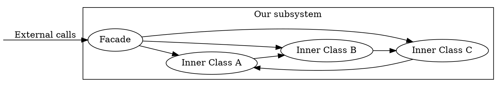

# Structural patterns

## Preface

This is an experimental way to present this material and might not match exactly other literature in terms of perspective.

## Structural patterns origins, true story


## Structural patterns form

These structural patterns generally fit into the following example. The only difference between them is intent.

```{.csharp .number-lines}
public class SomeClass : IOptionalInterfaceA {

	private IIOptionalInterfaceB optionalInstance;

	void SomeMethod() {
		... optional code ...

		if (optional condition)
		
		optionalInstance_or_someSubSystem_or_self.SomeOtherMethod();

		... optional code ...
	}
}
```

So literally any code, that based on incoming invocation calls some other code, can be considered one or more of these patterns .. purely by accident.

## Five Kata of structural programming

From [Wiki](https://en.wikipedia.org/wiki/Kata):

> Kata is a Japanese word (型 or 形) meaning "form" ... a detailed choreographed pattern of martial arts movements ... It is practised ... as a way to memorize and perfect the movements being executed

Five "Kata":

- Adapter: Use existing behavior of the object using a different interface.
- Facade: Provide a simple interface for a set of interfaces.
- Decorator: Dynamically add additional optional behavior(s) to the object.
- Proxy: Change the behavior of the object while preserving its interface.
- Bridge: Separate the interface from its implementation.

# Adapter

## Adapter

Key intent: Use existing behavior of the object using a different interface.

Used when we need to "adapt" already existing interface to be used via another already existing interface.

Also known as "wrapper". Sometimes called "glue code".

```{.csharp .number-lines}
// class adapter
public class AdapterAtoB : IInterfaceA, IInterfaceB {
	public void CallA() {
		CallB();
	}
}

// object adapter
public class AdapterAtoB : IInterfaceA {
	// Can either be set dynamically,
	// or created with-in the adapter (from constructor, etc).
	private IInterfaceB adaptee;

	public void CallA() {
		adaptee.CallB();
	}
}
```

Usually considered reasonable when used to adapt 3rdparty library to your own interfaces. Might be considered a bad practice otherwise. E.g. if you can change both implementations of interfaces, why are you making an adapter in a first place?

Examples:

- Adapting existing image loading library to be used with engine image loading interface. See [Unity Scripted Importers](https://docs.unity3d.com/Manual/ScriptedImporters.html)

- Adapting existing networking library to be used with-in the networking abstraction of the game.

- Adapting different audio engine .. etc

## Adapter example

Oversimplifying:

```{.csharp .number-lines}
public class OldInputToNewInputAdapter : IUnityInputInterface
{
	// Old API, Input.GetKeyDown
	public bool GetKeyDown(KeyCode key)
	{
		var newKeyCode = MapOldKeyCodeToNewKeyCode(key);

		// New API
		return NewInputSystem.MagicSause[newKeyCode].wasPressedThisFrame;
	}
}
```

## Shim

Related to adapter concept: [Shim](https://en.wikipedia.org/wiki/Shim_(computing)).

Shim is when we make an adapter of the interface to the interface itself:

- To bring new functionality using old implementation.
- Or implement old functionality using new implementation.

```{.csharp .number-lines}
// object adapter
public class Shim : IInterface {
	private IInterface implementation;

	public void Call() {
		implementation.Call();

		... or implement something else ....
	}
}
```

Examples:

- Provide compatibility interface to allow running older code with never versions of the framework ("Shim API's").

- Trace API usage by writing console messages (Also that makes shim a decorator).

# Façade

## Façade

Key intent: Provide a simple interface for a set of interfaces.

Also known as subsystem/library/framework Application Programming Interface (API).

Extra benefit: it's easier to vary implementation of subsystem if it's only used via facade.

```{.csharp .number-lines}
public class Facade {
	// Might also be static
	public void Call() {
		...
		subsystemA.CallA();
		...
		subsystemB.CallB();
		...
	}
}
```

Usually is considered a good practice.

Facade visually can look something like:



## Façade example

Façades might contain a bit of glue logic.

```{.csharp .number-lines}
public class CraftMechanicFacade {
	public static void CraftItem(ItemID item) {
		var requiredItems = CraftDatabase.GetRequiredItemsToCraftTheItem(item);
		var requiredGems  = CraftDatabase.GetRequiredGemsToCraftTheItem(item);

		if (!requiredItems.Select(PlayerItemManager.HasItem).All() ||
			PlayerProfile.Gems < requiredGems)
			return;

		if (!PlayerItemManager.SpendGems(requiredGems))
			return;

		if (!PlayerItemManager.UseAllItemsOrNone(requiredItems)) {
			PlayerItemManager.GiveGems(requiredGems);
			return;
		}

		PlayerItemManager.GiveItem(item);
		ParticleManager.SpawnParticles(...);
		SoundManager.PlayEffect(...);
	}

	private static ItemID[] GetRequiredItemsToCraftTheItem(...) { ... }
	private static int GetRequiredGemsToCraftTheItem(...) { ... }
}
```

## Façade example: cURL

From [here](https://curl.se/libcurl/c/simple.html):

```{.cpp .number-lines}
#include <stdio.h>
#include <curl/curl.h>

int main(void)
{
	CURL *curl;
	CURLcode res;

	curl = curl_easy_init();
	if(curl) {
		curl_easy_setopt(curl, CURLOPT_URL, "https://example.com");
		/* example.com is redirected, so we tell libcurl to follow redirection */
		curl_easy_setopt(curl, CURLOPT_FOLLOWLOCATION, 1L);

		/* Perform the request, res will get the return code */
		res = curl_easy_perform(curl);
		/* Check for errors */
		if(res != CURLE_OK)
			fprintf(stderr, "curl_easy_perform() failed: %s\n",
				curl_easy_strerror(res));

		/* always cleanup */
		curl_easy_cleanup(curl);
	}
	return 0;
}
```

And [actual implementation of easy interface](https://github.com/curl/curl/blob/master/lib/easy.c#L648).

## Façade as API

When starting a new feature, it's useful to create API first, figure out ergonomics, data flow, etc.

This might later drive/dictate the design of the implementation.

Good API can enable a great implementation, poor API can lock-in into a bad implementation.

Sometimes when adding a facade/API to existing codebase, the legacy code will drive the API design of the facade with all its quirks.

# Decorator

## Decorator

Key intent: Dynamically add additional optional behavior(s) to the object.

Another perspective: extend behavior via composition.

```{.csharp .number-lines}
public class Decorator : IInterface {
	// Most often reference is set externally
	private IInterface realObject;

	public void Call() {
		... new behavior code ...

		realObject.Call();

		... new behavior code ...
	}
}
```

In game development might be considered an anti-pattern depending on the context. Usually components are preferred instead.

Examples:

- Add a new flavor to the objects, NPC vs HalloweenNPC.

- Adjust return values based on external influence, e.g. item is on a sale in the store.

- Log calls to methods for debugging.

## Decorator classic example

::: columns
:::: column

```{.csharp .number-lines}
public abstract class Shape {
	public abstract string Describe();
}

public class Circle : Shape {
	public float Radius;

	public override string Describe() {
		return $"A circle with radius {Radius}";
	}
}

public class ColoredShape : Shape {
	public Shape ActualShape;
	public Color Color;

	public override string Describe() {
		return ActualShape.Describe() + $" with color {Color}";
	}
}

public class RotatedShape : Shape {
	public Shape ActualShape;
	public float Angle;

	public override string Describe() {
		return ActualShape.Describe() + $" with rotation {Angle}";
	}
}
```

::::
:::: column

```{.csharp .number-lines}
var circle = new Circle {
	Radius = ...
};
var coloredCircle = new ColoredShape {
	ActualShape = circle,
	Color = ...
};
var rotatedColoredCircle = new RotatedShape {
	ActualShape = coloredCircle,
	Angle = ...
};

// returns "A circle with radius ... with color ... with rotation ...";
var descr = rotatedColoredCircle.Describe();
```

::::
:::

## Decorator HTTP request example

```{.csharp .number-lines}
public interface IHttpRequest {
	void Send();
}

public class GETHttpRequest : IHttpRequest {
	public void Send() {
		socket.WriteLine("GET /index.html HTTP/1.1");
		socket.WriteLine("Host: www.example.org");
	}
}

public class HttpRequestAuthenticationDecorator : IHttpRequest {
	public HttpRequest Request;

	public void Send() {
		Request.Send();
		socket.WriteLine("Cookie: authToken=...;")
	}
}
```

# Proxy

## Proxy

Key idea: Change the behavior of the object while preserving its interface.

```{.csharp .number-lines}
public class Proxy : IInterface {
	// Object reference might be set externally,
	// or Proxy can create an instance itself (in the constructor, etc).
	private IInterface realObject;

	public void Call() {
		if(... special condition ...)
			realObject.Call();
	}
}
```

Examples:

- Check if user can access the methods before invoking the actual implementation.

- Locally caching access to remote resource.

- Delaying requests to the real object until it fully initializes (async proxy).

## Proxy example

```{.csharp .number-lines}
public interface IDatabaseConnection
{
	Data RequestData(string key);
}

public class BigTableDatabaseConnection : IDatabaseConnection
{
	public Data RequestData(string key) { ... } // slow
}

public class MySqlDatabaseConnection : IDatabaseConnection
{
	public Data RequestData(string key) { ... } // slow
}

public class CachedDataBaseConnection : IDatabaseConnection
{
	private IDatabaseConnection _connection;
	private Dictionary<string, Data> _cache = ...;
	public CachedDataBaseConnection(IDatabaseConnection connection) { ... }

	public Data RequestData(string key) {
		if (_cache.TryGetValue(key, out var result))
			return result;

		var data = _connection.RequestData(key);
		_cache.Add(key, data);
		return data;
	}
}
```

## Proxy remarks

Usually in gamedev this would be achieved via encapsulating database access in one place in the code, like `BackendCommunicationManager` or alike, and caching, etc behaviors would be codifying directly in the manager.

Proxies could be nice as a first step of trying to add something to a legacy codebase just to see if your idea works, a second step would be to implement it without proxy though ..

# Bridge

## Bridge

Key idea: Separate the interface from its implementation. So both can change independently.

Also known as "pointer to implementation" idiom (PIMPL) in C++. Can also be seen as adapter that owns both it's interfaces.

```{.csharp .number-lines}
public class Bridge {
	// Notice bridge "owns" the bridging interface that someone else needs to implement
	public interface IBridge {
		void CallA();
	}

	// Generally someone else can assign implementation pointer during runtime,
	// Though bridge can also create the instance during construction, etc
	private IBridge bridge;

	public void CallA() {
		bridge.CallA();
	}

	// Bridge itself provides methods, so has an interface of it's own
	public void CallB() {
		...
	}
}
```

Has a runtime cost. Might hinder optimization because compilers can't inline methods.

Examples:

- In C++ sometimes used to hide the actual implementation from the customer, due to implementation using too many large includes, etc.

- Having multiple implementations of same interface with some common behaviors for methods. E.g. checking that mesh is not null when passed to rendering API when you have D3D12, Vulkan, etc render.

- Adding new method to bridge without changing the interface of the bridge.

## Bridge example

```{.csharp .number-lines}
// This is what users use
public class RenderBridge {
	internal interface IRender {
		void RenderSprite(Texture texture, ...);
	}

	private IRender render;

	public void RenderSprite(Texture texture, ...) {
		if (texture == null)
			throw new ArgumentNullException();
		render.RenderSprite(texture, ...);
	}

	// Newly added API
	public void RenderSpriteWithDefaultTexture() {
		render.RenderSprite(GetDefaultTexture(), ...);
	}
}

// Implementation detail
internal VulkanRender : RenderBridge.IRender {
	public void RenderSprite(Texture texture, ...) {
		// texture is never null
		...
	}
}
```

# Final remarks

## Final remarks

- Personal suggestion: Try not to use these structural patterns as the basis of your thinking. Instead, prefer thinking about interactions/relationships between entities/objects.
- Sometimes these patterns happen after the fact: we code something and "oh, it's a proxy".
- Game development tends to gravitate towards "run same code over many entities", hence components + systems are usually preferred to decorators/proxies/bridges. This might not be a case in other industries.
- Some patterns might make more sense when used as an initial step in refactoring.

# Self study

## Self study

- What is Facade and why we use them?
- What is Adapter and why we use them?
- [Design Patterns: Facade](https://refactoring.guru/design-patterns/facade)
- [Design Patterns: Adapter](https://refactoring.guru/design-patterns/adapter)

Optionally:

- [Differences between Adapter, Proxy, Facade in human readable language](https://web.archive.org/web/20120311202925/http://www.netobjectives.com/PatternRepository/index.php?title=AdapterVersusProxyVersusFacadePatternComparison)
- [Differences between Decorator and Proxy in human readable language](https://doeken.org/blog/decorator-vs-proxy-pattern)
- [Design Patterns: Decorator](https://refactoring.guru/design-patterns/decorator)
- [Design Patterns: Proxy](https://refactoring.guru/design-patterns/proxy)
- [Design Patterns: Bridge](https://refactoring.guru/design-patterns/bridge)

Exercise:

```
- If you have a somewhat working game subsystem, check if you have any opportunities to use facade to simplify it's usage.
  For example if you have a shop, when you buy something you likely need to trigger a sound and maybe spawn particles.
  So a facade might unify your actual shop logic, audio and particle subsystem.

- Otherwise, try to implement a shim or decorator to write API calls to console via debug messages:

For example if you have a store subsystem like this:

interface IStore {
	void Buy(ItemType type);
}

class Store : IStore {
	public void Buy(ItemType type) { ... }
}

class DebugDecorator : IStore {
	...
	public void Buy(ItemType type) {
		Debug.Log($"Buying item {type}");
		...
	}
}
```
