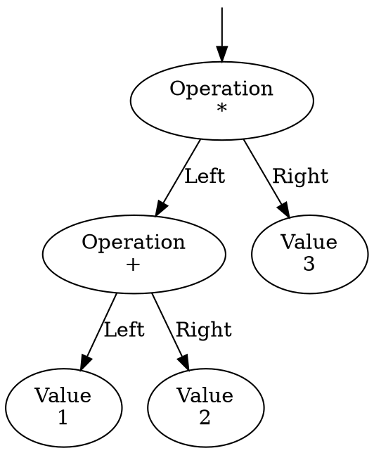

---
title: Interpreter Pattern, Introduction to Compilers
author: Dmytro Ivanov
date: Nov, 2021
---

# Let's invent an interpreter

## Reverse Polish notation (RPN)

::: columns
:::: column


There are three common mathematical notations:

- "3 + 2" is infix notation, requires parenthesis.
- "+ 3 2" is prefix notation, also known as "Polish notation", invented by Jan Łukasiewicz in 1924 as parenthesis-free notation.
- "3 2 +" is postfix notation, or "Reverse Polish notation", invented around 1957-1958.

RPN examples:

- "1 + 2" will become "1 2 +"
- "1 + (2 + 3)" will become "2 3 + 1 +" or "1 2 3 + +"

RPN first used in:

- 1960/1963 English Electric Company KDF9
- 1961/1963 Burroughs B5000
- 1968 Hewlett-Packard 9100A
- 1972 Hewlett-Packard 35
- many others

Did you know?

- Lisp is written in prefix notation because it's easy to parse.
- Forth is written in postfix notation because it's even easier to parse.

::::
:::: column


::::
:::

## RPN Calculator

```{.csharp .number-lines}
var input = "3 2 1 + +";

// makes an array of ["3", "2", "1", "+", "+"]
var tokens = input.Split(new []{' '}, StringSplitOptions.RemoveEmptyEntries);

// First calculators only had stack of 3-4 elements.
// But this is 2021, we can have billions of values.
var stack = new Stack<float>();

foreach (var token in tokens)
{
	if (float.TryParse(token, out var value))
		// if our token is a number, just push it onto the stack
		stack.Push(value);
	else
	{
		// otherwise take first two values from stack
		var b = stack.Pop();
		var a = stack.Pop();

		// and make an operation
		if (token == "+") stack.Push(a + b);
		if (token == "-") stack.Push(a - b);
		if (token == "*") stack.Push(a * b);
		if (token == "/") stack.Push(a / b);
	}
}

Console.WriteLine($"= {stack.Pop()}");
```

That's it! :)

Now think how would you implement an infix calculator this way ... looks like we need more tools for this.

## Where are we even?


(From [here](https://www.tutorialspoint.com/compiler_design/compiler_design_phases_of_compiler.htm))

## The Tools


(From Wiki)

## The Parsers

LL(k) - Left-to-right, Leftmost derivation, k symbols of lookahead, meaning LL(0) no lookahead, LL(1) one symbol lookahead.

LR(k) - Left-to-right, Rightmost derivation in reverse, k symbols of lookahead.


(From [here](https://stackoverflow.com/questions/6379937/what-about-theses-grammars-and-the-minimal-parser-to-recognize-it))

## What even we are trying to produce? Abstract Syntax Tree!

::: columns
:::: column


::::
:::: column

```{.csharp .number-lines}
while(b != 0)
    if (a > b)
        a = a - b
    else
        b = b - a

return a;
```

::::
:::

## (Extended) Backus–Naur form (EBNF) and friends

Our RPN grammar would be:

```
Expression ::= ( Number | Add | Sub | Mul | Div ) Expression?

Add    ::= '+'
Sub    ::= '-'
Mul    ::= '*'
Div    ::= '/'
Number ::= #'[0-9]+'
```

Two type of symbols:

- Terminal symbol - symbol that cannot be expanded further Like `+`, `-`, `0`, `1`, `2`, ...
- Non-terminal symbol - symbol that can be expanded further. Like `Expression`, `Number`, `Add`, `Sub`, ... which are nodes in AST.

Notice this grammar is recursive but still could be rewritten as a regex. Same language can have multiple grammars.

So we could rewrite it as a regular grammar if we wanted to: `([0-9]+|\+|-|\*|\/)*` and [regexper](https://regexper.com/#%28%5B0-9%5D%2B%7C%5C%2B%7C-%7C%5C*%7C%5C%2F%29*) for it:


Hence why it's so trivial to parse it.

# Ok, So now we have all the tools!

## Basic infix grammar

```
Expression ::= Product (( '+' | '-' ) Expression)?

Product    ::= Value   (( '*' | '/') Product)?

Value      ::= Number | '(' Expression ')'

Number     ::= #'[0-9]+'
```

That's it! Magic!

Just 4 lines, and it:

- Has operator precedence, `1 + 2 * 3` will be parsed as `1 + (2 * 3)`
- Supports parentheses, like `(1 + 2) * 3`
- Is right associative, which is not ideal, `1 + 2 + 3 + 4` will be parsed as `1 + (2 + (3 + 4))`
- Recursive, no longer possible to represent in regular expression, at least not without extensions to regex

Needs a few touch-ups and we can jump to parsing it.

## Slightly touched-up infix grammar

You will find that every tool has slightly different EBNF syntax.

Here's one such online tool that can generate some cool stuff for us called [Grammophone](https://mdaines.github.io/grammophone)

And it has slightly different grammar format:

```
Expression -> Product Expression2 .
Expression2 -> + Expression .
Expression2 -> - Expression .
Expression2 -> .
Product -> Value Product2 .
Product2 -> * Product .
Product2 -> / Product .
Product2 -> .
Value -> id | ( Expression ) .
```

Now [Grammophone](https://mdaines.github.io/grammophone/) is happy, and confirms it is LL(1) and LR(1) grammar.

# LL(1) infix calculator

## AST

Usually AST is whatever your non-terminating symbols are.

But when doing parsers manually one usually can make it a bit more nicer.

```{.csharp .number-lines}
class Expression
{
}

class ValueExpression : Expression
{
	public float Number;
}

class TwoOperandOperationExpression : Expression
{
	public Expression Left;
	public char Operation; // + - * /
	public Expression Right;
}
```

## The top-down hand written parser structure

Usually parsers are generated by tools, but sometimes it's doable to write them by hand:

```{.csharp .number-lines}
class Parser {
	public string[] Tokens; // ["1", "+", "2"]
	internal int _position; // Current position

	// Helpers
	internal string Current => Tokens[_position];
	internal string Next    => _position + 1 < Tokens.Length ? Tokens[_position + 1] : "";
	internal void Advance() => _position++;
	internal bool IsEnd()   => _position >= Tokens.Length;

	public Expression ParseExpression() {
		...
	}

	internal Expression ParseProduct() {
		...
	}

	internal Expression ParseValue() {
		...
	}
}
```

## The top-down LL(1) hand written parser

::: columns
:::: column

```{.csharp .number-lines}
class Parser {
	...
	public Expression ParseExpression() {
		var left = ParseProduct();

		if (IsEnd() || Next is not ("+" or "-"))
			return left;

		Advance();
		var operation = Current[0];

		Advance();
		var right = ParseExpression();

		return new TwoOperandOperationExpression {
			Left = left,
			Operation = operation,
			Right = right
		};
	}

	internal Expression ParseProduct() {
		var left = ParseValue();

		if (IsEnd() || Next is not ("*" or "/"))
			return left;

		Advance();
		var operation = Current[0];

		Advance();
		var right = ParseProduct();

		return new TwoOperandOperationExpression {
			Left = left,
			Operation = operation,
			Right = right
		};
	}
```

::::
:::: column

```{.csharp .number-lines}
	internal Expression ParseValue() {
		if (Current is not "(")
			return new ValueExpression {
				Number = float.Parse(Current)
			};

		Advance();
		var expr = ParseExpression();

		Assert.That(Next is ")");
		Advance();

		return expr;
	}
}
```

::::
:::

## Does it work?

If we parse `( 1 + 2 ) * 3` and sprinkle debug messages to AST nodes we get:

```
'*' Operation:
    '+' Operation:
        Value 1
        Value 2
    Value 3
```

Which in diagram would be:



Oh geez! We made one half of a compiler. Next half is to convert AST to machine code .. or ..

# Interpreter pattern

## Interpreter pattern

::: columns
:::: column

In some limited cases, it's possible to give AST ability to compute itself on the go:

```{.csharp .number-lines}
abstract class Expression {
	public abstract float Interpret();
}

class ValueExpression : Expression {
	public float Number;

	public override float Interpret() {
		return Number;
	}
}

class TwoOperandOperationExpression : Expression {
	public Expression Left;
	public char Operation;
	public Expression Right;

	public override float Interpret()
	{
		var a = Left.Interpret();
		var b = Right.Interpret();
		return Operation switch
		{
			'+' => a + b,
			'-' => a - b,
			'*' => a * b,
			'/' => a / b
		};
	}
}
```

::::
:::: column

Let's check if our parser + evaluator is correct:

- `( 1 + 2 ) * 3` returns `9`
- `( 1 + 2 ) * 3 + 2 * 3` returns `15`

And that's pretty much what interpreter pattern is.

A more formal name is an abstract syntax tree interpreter.

::::
:::

## Interpreter pattern

Interpreter patter is a very specific, minimalist snapshot of general compiler:

- Grammar that can be ad-hoc evaluated. Most grammar cannot be, e.g. if you have AST node representing `class`, what you will do?
- AST implemented as composite classes.
- Every class having `Interpret` method
- Recursively traverse the hierarchy and compute result.
- `Interpret` can accept a "Context", like a stack or similar, making it in a very barebone virtual machine.

Usually sufficient for basic equations.

# Taking the next step

## What if instead of interpreting we generate instructions?

::: columns
:::: column

```{.csharp .number-lines}
abstract class Expression {
	public abstract IEnumerable<Instruction> Compile();
}

class ValueExpression : Expression {
	public float Number;

	public override IEnumerable<Instruction> Compile() {
		yield return new Instruction {
			InstructionType = InstructionType.PushValue, Value = Number
		};
	}
}

class TwoOperandOperationExpression : Expression {
	public Expression Left;
	public char Operation;
	public Expression Right;

	public override IEnumerable<Instruction> Compile() {
		foreach (var instruction in Left.Compile())
			yield return instruction;

		foreach (var instruction in Right.Compile())
			yield return instruction;

		switch(Operation)
		{
			case '+': yield return new Instruction { InstructionType = InstructionType.Add }; break;
			case '-': yield return new Instruction { InstructionType = InstructionType.Sub }; break;
			case '*': yield return new Instruction { InstructionType = InstructionType.Mul }; break;
			case '/': yield return new Instruction { InstructionType = InstructionType.Div }; break;
		}
	}
}

```

::::
:::: column

```{.csharp .number-lines}
enum InstructionType {
	PushValue,
	Add,
	Sub,
	Mul,
	Div
}

class Instruction {
	public InstructionType InstructionType;
	public float? Value;
}
```

::::
:::

## First compile

`( 1 + 2 ) * 3 + 2 * 3` gets compiled to:

```
push value '1'
push value '2'
pop two values, add them, push result
push value '3'
pop two values, multiply them, push result
push value '2'
push value '3'
pop two values, multiply them, push result
pop two values, add them, push result
```

Our first compiled program!

## What if we were running the instructions?

::: columns
:::: column

```{.csharp .number-lines}
class MyFirstVirtualMachine
{
	public Stack<float> Stack = new();

	public float Run(Instruction[] program) {
		for (var instructionPointer = 0;
			instructionPointer < program.Length;
			instructionPointer++)
		{
			var instruction = program[instructionPointer];

			switch (instruction.InstructionType)
			{
				case InstructionType.PushValue:
					Stack.Push(instruction.Value.GetValueOrDefault());
					break;
				case InstructionType.Add:
				{
					var (a, b) = Stack.PopTwo();
					Stack.Push(a + b);
					break;
				}
				case InstructionType.Sub:
					...
				case InstructionType.Mul:
					...
				case InstructionType.Div:
					...
			}
		}

		return Stack.Pop();
	}
}
```

::::
:::: column

```{.csharp .number-lines}
static class StackExtensions {
	// helper
	public static (float a, float b) PopTwo(this Stack<float> stack) {
		var b = stack.Pop();
		var a = stack.Pop();
		return (a, b);
	}
}
```

This is a bytecode interpreter.

::::
:::

## Our first run

Combine all things together:

```{.csharp .number-lines}
var input = "( 1 + 2 ) * 3 + 2 * 3";

// Lexer
var tokens = input.Split(new []{' '}, StringSplitOptions.RemoveEmptyEntries);

// Parser
var expr = new Parser { Tokens = tokens }.ParseExpression();

// AST -> bytecode instructions
var program = expr.Compile();

// Virtual Machine
var result = new MyFirstVirtualMachine().Run(program.ToArray());

Console.WriteLine(result);
```

Prints `15`.

Congratulations you just made a compiler and a virtual machine / interpreter!

## The final step

If instead of our own instructions we generate a real processor instructions, like x64 that most of us have today:

```{.cpp .number-lines}
const uint8_t program[] = [0x4c, 0x03, 0x47, 0x0a]; // add r8,QWORD PTR [rdi+0xa]

Windows_Mark_This_Memory_Executable(program);

typedef void (*MyFunctionPointer)();

var magicFunction = (MyFunctionPointer)program;

magicFunction();
```

This is Just-In-Time compiler! This is how LuaJit, Chrome V8, etc work.

## Final remarks

- Interpreter pattern is just `Interpret` method on AST.
- Has very limited, yet useful properties. Especially when you need ad-hoc scripting.
- In some cases it's better to take a next step and compile AST to bytecode. Making small VM's is fun.
- Usually found in game consoles, where function calls can be a bit scriptable.
- Or game configuration files.

In general:

- Compilers are not magic boxes, though they are not simple.
- A lot of stuff is formalized, can be studied if needed.
- During your career you are likely to find bugs in compilers, so it's good to be at least somewhat prepared.

# Self study

## Self study (Optional)

All optional for this lecture:

- Play with RPN calculator, get hands on feel how the stack works.
- Implement RPN calculator yourself.
- Implement a basic Math Expression AST (can copy paste from here) and try constructing simple expressions.
- Implement `Interpret` on AST and see how it works.
- [Game Programming Patterns: Bytecode](http://gameprogrammingpatterns.com/bytecode.html)
- Lookup [ANTLR grammars](https://github.com/antlr/grammars-v4) this might sometime save your day. [ANTLR](https://en.wikipedia.org/wiki/ANTLR) in general.
